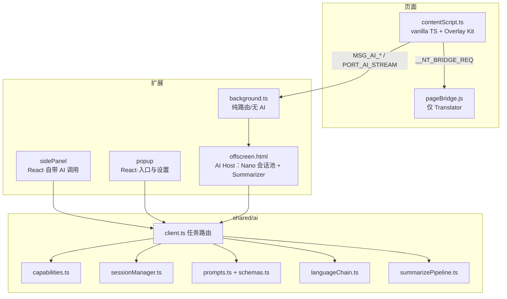
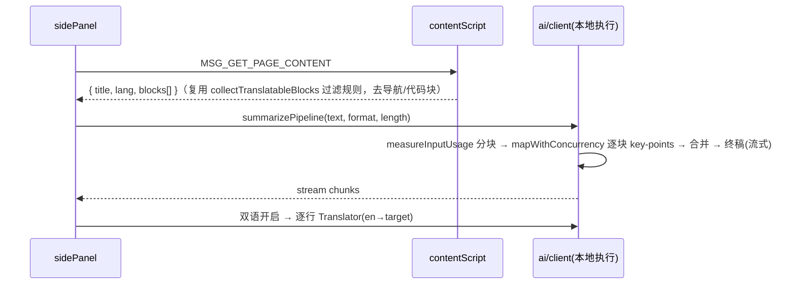

# Native Translate · 本地 AI 全家桶实现方案

> 版本：v1.0 ｜ 日期：2026-08-13 ｜ 状态：待评审
> 范围：基于 Chrome built-in AI（Gemini Nano + 任务型 API）新增 9 个功能，覆盖三个梯队；配套架构升级与设计系统。
> 原则：**所有推理 100% 本地，不做任何云端 fallback**——这是本插件的产品底线。

---

## 目录

1. [背景与目标](#1-背景与目标)
2. [API 能力与约束](#2-api-能力与约束)
3. [总体架构](#3-总体架构)
4. [设计系统（UI 规范）](#4-设计系统ui-规范)
5. [功能详细设计 F1–F9](#5-功能详细设计)
6. [工程改造清单](#6-工程改造清单)
7. [实施路线图](#7-实施路线图)
8. [测试策略](#8-测试策略)
9. [风险与应对](#9-风险与应对)
10. [附录：Prompt 模板与 JSON Schema](#10-附录prompt-模板与-json-schema)

---

## 1. 背景与目标

当前插件（v2.4.2）只使用了 Translator 与 LanguageDetector 两个 API。Chrome built-in AI 已提供 6 个任务型 API + 通用 Prompt API，其中 **Summarizer（138 stable）与扩展版 Prompt API（138 stable，多模态 + 结构化输出）** 可直接使用，与 manifest 的 `minimum_chrome_version: 138` 完全兼容。

### 功能总览

| # | 功能名 | 核心 API | 梯队 | 目标版本 |
|---|--------|---------|------|---------|
| F1 | 智能摘要 Smart Summary | Summarizer (+Translator) | 1 | v2.5 |
| F2 | 划词助手 Selection Assistant | Prompt / Summarizer / Translator | 1 | v2.5 |
| F3 | 写作助手 Writing Assistant | Prompt (+Translator) | 1 | v2.5 |
| F4 | 截图翻译 Screenshot Translate | Prompt 多模态（图片） | 2 | v2.6 |
| F5 | 页面问答 Page Chat | Prompt + Summarizer | 2 | v2.6 |
| F6 | 学习模式 Learning Mode | Prompt 结构化输出 (+Translator) | 2 | v2.6 |
| F7 | 语音转译 Voice Transcribe | Prompt 多模态（音频，需 GPU） | 3 | v2.7 |
| F8 | 章节导读 EPUB Digest | Summarizer (+现有 EPUB 管线) | 3 | v2.7 |
| F9 | 智能提取 Smart Extract | Prompt 结构化输出 | 3 | v2.7 |

### 非目标（Out of Scope）

- 云端 AI fallback（含官方 Firebase AI Logic hybrid 方案）——违背隐私承诺，明确不做。
- Writer / Rewriter / Proofreader 专用 API 的直接依赖——仍在 developer trial，全部先用 Prompt API 实现同等能力，稳定后在 `src/shared/ai/` 内部无痛切换。
- 移动端支持（built-in AI 仅桌面 Chrome）。

---

## 2. API 能力与约束

### 2.1 状态矩阵（2026-08）

| API | Web | 扩展 | 本项目用法 |
|-----|-----|------|-----------|
| Translator | 138 stable | 138 stable | 已用（contentScript / pageBridge / sidePanel） |
| LanguageDetector | 138 stable | 138 stable | 已用 |
| Summarizer | 138 stable | 138 stable | **新增**：F1 F2 F5 F8 |
| Prompt API（`LanguageModel`） | 148 stable | **138 stable** | **新增**：F2–F7、F9 |
| Writer / Rewriter / Proofreader | dev trial | dev trial | 不依赖；用 Prompt API 等价实现 |

### 2.2 Gemini Nano 硬件门槛（Prompt / Summarizer 共用）

- 磁盘：所在卷 ≥ 22GB 空闲（模型本体数 GB，随版本浮动）。
- GPU > 4GB VRAM，或 CPU ≥ 16GB RAM + 4 核（音频输入**必须 GPU**）。
- OS：Win 10/11、macOS 13+、Linux、ChromeOS（Chromebook Plus）。
- 模型全浏览器共享，**下载一次全家可用**；与 Translator 的语言小模型相互独立。

推论：必须把「能力探测 → 引导下载 → 优雅降级」做成统一基建（见 3.5），不满足门槛的用户只是看不到 AI 功能入口，翻译主功能不受影响。

### 2.3 运行环境约束（决定架构）

| 上下文 | Translator/Detector | Summarizer | LanguageModel |
|--------|--------------------|------------|---------------|
| 扩展页面（popup / sidePanel / offscreen / welcome） | ✅ | ✅ | ✅（138+） |
| 内容脚本 isolated world | ❌（已知，故有 pageBridge） | ❌ | ❌ |
| 页面 main world（pageBridge） | ✅ | ✅（138+） | ⚠️ 148+ 且受站点 Permission Policy 限制 |
| 扩展 Service Worker | ❌（无 window） | ❌ | ❌ |

**结论**：新增 AI 能力统一收敛到扩展页面运行。side panel / popup 内的功能直接本地调用；页内功能（划词、学习模式、截图等）经 background 路由到 **offscreen document**。pageBridge 保持只做 Translator，不再扩展职责（避免依赖站点 Permission Policy 与 Chrome 148 门槛）。

### 2.4 语言链约束

Prompt API 官方支持语言：en / ja / es / de / fr（持续扩充），中文输出无质量保证。统一策略（`src/shared/ai/languageChain.ts`）：

```
用户目标语言 ∈ Nano 支持列表 → Nano 直接输出目标语言
否则 → Nano 输出英文 → 本地 Translator (en → 目标语言) → 输出
```

全程本地闭环；`expectedInputs/expectedOutputs` 显式声明并以 `availability()` 结果为准动态决定链路。

---

## 3. 总体架构

### 3.1 分层图



### 3.2 AI 能力层 `src/shared/ai/`（新增目录）

| 文件 | 职责 |
|------|------|
| `capabilities.ts` | 各 API `availability()` 探测 + 硬件失败归因；结果缓存至 `nativeTranslate.aiCapabilities`（TTL 24h，模型下载完成时主动刷新）；导出 `useAiCapabilities()` hook 与内容脚本可用的 `getAiCapabilities()` |
| `client.ts` | 统一任务入口 `runAiTask(req)` / `streamAiTask(req, onChunk)`。扩展页面内直接执行；内容脚本内自动经 `chrome.runtime` 转发给 offscreen（见 3.3） |
| `sessionManager.ts` | `LanguageModel` 会话池：按 `task+langs` 复用、`clone()` 派生、LRU ≤ 4、闲置 5min `destroy()`、`contextoverflow` 监听并用 Summarizer 压缩重建（官方 session compacting 模式） |
| `prompts.ts` / `schemas.ts` | 全部 system prompt 模板与 JSON Schema 常量，**集中管理、版本号后缀**（如 `EXPLAIN_V1`），便于 A/B 与回归 |
| `languageChain.ts` | 2.4 的语言链决策 + Nano 输出→Translator 补译 |
| `summarizePipeline.ts` | 长文分块（按 `measureInputUsage()`/`inputQuota` 自适应）→ 并发 chunk 摘要 → summary-of-summaries 合并；复用 `translationQueue.mapWithConcurrency` |
| `types.ts` | `AiTask` 联合类型、请求/响应类型；引入 `@types/dom-chromium-ai` 替换手写声明 |

`AiTask` 联合类型（贯穿全链路的核心契约）：

```ts
export type AiTask =
  | { kind: 'summarize'; text: string; format: SummaryFormat; length: SummaryLength; targetLanguage: LanguageCode }
  | { kind: 'explain'; text: string; contextText?: string; targetLanguage: LanguageCode }
  | { kind: 'polish'; text: string; tone: WritingTone; targetLanguage: LanguageCode }
  | { kind: 'proofread'; text: string }
  | { kind: 'ocrTranslate'; imageDataUrl: string; targetLanguage: LanguageCode }
  | { kind: 'chat'; sessionId: string; question: string; pageDigest?: string; targetLanguage: LanguageCode }
  | { kind: 'pickWords'; text: string; level: CefrLevel; targetLanguage: LanguageCode }
  | { kind: 'defineWord'; word: string; sentence: string; targetLanguage: LanguageCode }
  | { kind: 'transcribe'; audio: ArrayBuffer; targetLanguage: LanguageCode }
  | { kind: 'extract'; text: string; entity: 'auto' | 'event' | 'contact' | 'product'; targetLanguage: LanguageCode }
```

### 3.3 消息与流式协议（`src/shared/messages.ts` 扩展）

一次性请求（`chrome.runtime.sendMessage`，bg 确保 offscreen 存活后带 `target: 'offscreen'` 转发）：

```ts
export const MSG_AI_TASK = 'NATIVE_TRANSLATE_AI_TASK' as const            // cs/popup → bg → offscreen
export const MSG_AI_CAPABILITIES = 'NATIVE_TRANSLATE_AI_CAPABILITIES' as const // 查询/刷新能力缓存
export const MSG_GET_PAGE_CONTENT = 'NATIVE_TRANSLATE_GET_PAGE_CONTENT' as const // sidePanel → cs：抽取正文
export const MSG_CAPTURE_REGION = 'NATIVE_TRANSLATE_CAPTURE_REGION' as const    // cs → bg：captureVisibleTab
export const MSG_SUMMARIZE_PAGE = 'NATIVE_TRANSLATE_SUMMARIZE_PAGE' as const    // popup → sidePanel 意图
export const MSG_TOGGLE_LEARNING_MODE = 'NATIVE_TRANSLATE_TOGGLE_LEARNING' as const
export const MSG_START_REGION_SELECT = 'NATIVE_TRANSLATE_START_REGION_SELECT' as const // bg(command/menu) → cs
```

流式响应（chat / 长摘要 / 写作助手预览）走长连接 Port：

```ts
export const PORT_AI_STREAM = 'nativeTranslate.aiStream' as const
// cs ↔ bg ↔ offscreen 双段 Port，bg 中继 pipe；消息帧：
type AiStreamFrame =
  | { type: 'chunk'; requestId: string; delta: string }
  | { type: 'done'; requestId: string; usage?: { contextUsage: number; contextWindow: number } }
  | { type: 'error'; requestId: string; code: AiErrorCode; message: string }
```

错误码统一：`model_unavailable | download_required | hardware_unsupported | quota_exceeded | language_unsupported | aborted | internal`。UI 层按码给出本地化文案与动作（如 `download_required` → 弹 AiModelGate）。

### 3.4 设置与存储 Schema 扩展（`src/shared/settings.ts`）

```ts
export const AI_SETTINGS_KEY = 'nativeTranslate.aiSettings' as const
export const AI_CAPABILITIES_KEY = 'nativeTranslate.aiCapabilities' as const
export const VOCAB_BOOK_KEY = 'nativeTranslate.vocabBook' as const
export const SIDE_PANEL_INTENT_KEY = 'nativeTranslate.sidePanelIntent' as const // popup/菜单 → sidePanel 跨上下文意图

export interface AiSettings {
  features: { summary: boolean; selection: boolean; writing: boolean; screenshot: boolean;
              chat: boolean; learning: boolean; voice: boolean; epubDigest: boolean; extract: boolean }
  summary: { format: 'key-points' | 'tldr' | 'teaser' | 'headline'; length: 'short' | 'medium' | 'long'; bilingual: boolean }
  writing: { defaultTone: 'professional' | 'friendly' | 'concise'; }
  learning: { level: 'A2' | 'B1' | 'B2' | 'C1'; showPhonetic: boolean }
  selection: { trigger: 'auto' | 'modifier'; minChars: number }
}
```

所有读写走现有 `useChromeLocalStorage`（一次水合 + 250ms debounce 落盘）。`vocabBook` 上限 2000 词，超限 LRU 淘汰并提示导出。

### 3.5 模型下载与可用性 UX（统一基建）

新组件 `AiModelGate`（扩展页）+ Overlay Kit 等价物（页内）：

```
状态机：unknown → checking → unavailable(hardware/os) → downloadable → downloading(p%) → ready → error
```

- 入口处（popup AI 区、sidePanel 新 tab、划词工具条首次触发）都套 Gate：`ready` 直接渲染功能；`downloadable` 渲染「启用本地 AI」引导卡（说明模型体积/一次下载全家可用/数据不出设备），点击后 `create()` + `monitor.downloadprogress` 驱动 ProgressRing；`unavailable` 则整组功能入口隐藏，仅在设置里保留一行灰态说明（附 `chrome://on-device-internals` 链接文案）。
- 下载状态写入 `nativeTranslate.aiCapabilities`，各上下文通过 storage onChanged 同步，避免重复弹引导。
- 复用现有 `ModelDownloadToast` 的视觉语言，但 Nano 的下载进度独立于 Translator 的 firstRunStatus，不混用字段。

### 3.6 offscreen document（新增入口）

- `src/offscreen/offscreen.html` + `offscreen.ts`（无 React，纯逻辑宿主）。
- background 在首个 `MSG_AI_TASK` / Port 连接时 `chrome.offscreen.createDocument({ url: 'offscreen.html', reasons: ['DOM_PARSER'], justification: 'Run Chrome built-in on-device AI (Gemini Nano), which is only exposed to documents' })`；已存在则复用（`chrome.runtime.getContexts` 探测）。
- 生命周期：offscreen 内部空闲 10min（无活跃会话且无进行中任务）主动 `window.close()` 释放内存；下次请求再拉起。
- Phase 0 spike 必须实证：offscreen 内 `LanguageModel`/`Summarizer` 可用性、多模态图片输入、`responseConstraint` 结构化输出（见 7.1 验收）。

---

## 4. 设计系统（UI 规范）

> 目标：把「本地 AI」做出高级感——克制的玻璃质感 + 一致的 AI 渐变识别色 + 细腻微动效；页内 UI 与站点完全隔离、零污染。

### 4.1 设计语言

- **基调**：延续现有 zinc 中性色 + 功能蓝（翻译类操作），新增 **AI 识别渐变 `violet-500 → fuchsia-500`**——凡 Nano 驱动的能力（解释/问答/写作/OCR）统一用渐变点缀（图标描边、按钮、Badge、进度环），用户一眼区分「翻译」与「生成式」。
- **形态**：卡片 `radius 12px`（页内浮层 `14px`）；分层柔和阴影；页内浮层用半透明背景 + `backdrop-blur(16px)` 玻璃质感，暗色下 `bg-zinc-900/85`。
- **密度**：延续 `text-sm` 紧凑排版；结果区正文 `text-[13px]/relaxed`；数字用 `tabular-nums`。
- **品牌一致性**：popup / sidePanel / 页内浮层 / welcome 共享同一套 token，浮层视觉 = 「迷你版 side panel」。

### 4.2 Design Tokens（`src/styles/tailwind.css` 增加 `@theme`）

```css
@theme {
  /* AI 识别色 */
  --color-ai-from: oklch(0.606 0.25 292.7);   /* violet-500 */
  --color-ai-to: oklch(0.667 0.295 322.1);    /* fuchsia-500 */
  /* 浮层 */
  --shadow-overlay: 0 12px 32px rgb(0 0 0 / 0.14), 0 2px 8px rgb(0 0 0 / 0.08);
  --radius-overlay: 14px;
  /* 动效 */
  --ease-out-quart: cubic-bezier(0.25, 1, 0.5, 1);
  --animate-fade-up: fade-up 0.18s var(--ease-out-quart);
  --animate-shimmer: shimmer 1.6s linear infinite;
}
@keyframes fade-up { from { opacity: 0; transform: translateY(4px) scale(0.98); } to { opacity: 1; transform: none; } }
@keyframes shimmer { from { background-position: 200% 0; } to { background-position: -200% 0; } }
```

### 4.3 组件清单

**扩展页（React + Radix，放 `src/components/ui/`）——新增：**

| 组件 | 依赖 | 用途 |
|------|------|------|
| `Popover` `Tooltip` `DropdownMenu` `ScrollArea` `Dialog` | 对应 @radix-ui 包 | 通用 |
| `SegmentedControl` | 自研（cva） | 摘要格式/长度、语气选择 |
| `Kbd` | 自研 | 快捷键提示（`Alt+Shift+S`） |
| `Skeleton` | 自研 shimmer | 加载占位 |
| `ProgressRing` | 自研 SVG | 模型下载、上下文用量 |
| `StreamingText` | 自研 | 流式渲染：尾部渐显 + 呼吸光标；`aria-live="polite"` |
| `MarkdownView` | 自研（轻量白名单渲染器，仅 p/ul/ol/li/strong/em/code/h3，其余转义） | 摘要/问答结果；**不引入 md 库、不 innerHTML 原文** |
| `AiBadge` `GradientButton`（Button 增加 `variant: 'ai'`） | cva | AI 功能识别 |
| `AiModelGate` | 组合 | 3.5 状态机容器 |
| `EmptyState` | 自研 | 各 tab 空态（插画级 icon + 一句话 + CTA） |

**页内 Overlay Kit（vanilla TS，`src/content/overlayKit/`）——受构建约束（无 splitChunks、contentScript 不含 React），页内 UI 全部原生实现：**

| 模块 | 说明 |
|------|------|
| `host.ts` | `ShadowRoot` 宿主：`position: fixed` + `z-[2147483647]`，`adoptedStyleSheets` 注入 token 样式，`prefers-color-scheme` 同步明暗，`dir` 跟随 UI 语言（RTL） |
| `anchor.ts` | 基于 `@floating-ui/dom` 的锚定定位（flip/shift/offset），选区/元素/矩形三种锚 |
| `components.ts` | 原生组件工厂：pill 工具条、玻璃卡片、按钮、tab、骨架行、流式文本节点、进度环（与 4.2 token 一一对应） |
| `focus.ts` | Esc 关闭、点击外部关闭、焦点圈定、`role="dialog"/"toolbar"` |

### 4.4 动效规范

- 进出场：浮层 `fade-up 180ms`，工具条 `120ms`；关闭反向 `120ms`。
- 流式输出：新增文本 `opacity 0→1 160ms`，尾部 1 字符宽呼吸光标；完成后光标淡出。
- 骨架：shimmer 渐变扫过（`--animate-shimmer`），行宽 100%/83%/61% 三段模拟段落。
- 下载：ProgressRing 平滑插值（每帧 lerp 15%），完成时一次 240ms 的 scale-pop。
- 全部动效尊重 `prefers-reduced-motion: reduce` → 退化为瞬时切换。

### 4.5 可访问性与 i18n

- 浮层容器 `role` 语义化 + `aria-live="polite"`（沿用现有规范）；工具条按钮均有 `aria-label`。
- 所有新文案走 `t()`，新增 key 统一 `ai_` 前缀，11 个 locale 同步补齐（见 6.4）。
- RTL：Overlay Kit 宿主继承 `getUILocale()` 方向；SegmentedControl/工具条镜像。

---

## 5. 功能详细设计

> 每个功能按：定位 → 入口与交互 → UI → 技术流程 → 缓存与性能 → 降级 → 新增文件 → 验收 的结构描述。Prompt 与 Schema 全文见附录 10。

### F1 智能摘要（Summarizer）

**定位**：读外语长文前先看双语要点，降低「要不要全文翻译」的决策成本。翻译心智的自然延伸，全 stable API，第一个上。

**入口**：① popup「摘要此页面」按钮（与「翻译此页面」并列）；② 快捷键 `Alt+Shift+Y`；③ 页面右键菜单「智能摘要」；④ sidePanel 新增「摘要」tab。①②③ 统一写 `SIDE_PANEL_INTENT_KEY = { kind: 'summary', tabId }` 后 `sidePanel.open()`，摘要 tab 读 intent 自启动。

**UI（sidePanel 摘要 tab）**：

```
┌─ 摘要 ────────────────────────────────┐
│ [关键要点 ▾] [中 ▾]      [双语 ⇄] [↻] │  ← SegmentedControl ×2 + 开关
│ ┌───────────────────────────────────┐ │
│ │ ◈ 页面标题（favicon + 域名小字）      │ │
│ │ ─────────────────────────────────  │ │
│ │ • 要点一（流式渐显）…                │ │
│ │   ▸ 原文对照小字（bilingual 开启时）  │ │
│ │ • 要点二 …                          │ │
│ └───────────────────────────────────┘ │
│ [复制] [复制为 Markdown]    字数·耗时   │
└───────────────────────────────────────┘
```

生成中显示骨架三行 + 顶部细进度条；格式/长度切换即取消当前任务重跑（AbortSignal）。

**技术流程**：



- 正文抽取：新 `src/shared/extract.ts`，基于 `collectTranslatableBlocks` 的骨架规则做纯函数版（可单测），输出 `{ blocks: string[], truncated: boolean }`，上限 ~60k chars。
- Summarizer 在 sidePanel 窗口直接创建（它是扩展页面，无需 offscreen）；`outputLanguage` 尝试目标语言，`language_unsupported` 时走语言链（英文摘要 + Translator 补译）。

**缓存**：`Map<contentHash+format+length+lang, result>` 内存缓存（sidePanel 生命周期内）；切 tab 回来不重跑。

**降级**：Summarizer unavailable → tab 内显示 AiModelGate；选区 < 200 字直接建议用翻译。

**新增文件**：`src/shared/extract.ts`、`src/sidePanel/tabs/SummaryTab.tsx`、`src/shared/ai/summarizePipeline.ts`。

**验收**：3k 字英文文章 p50 ≤ 8s 出首屏要点；双语对照正确率抽检；10 万字页面自动截断且 UI 提示「已基于前 N 字摘要」；复制导出格式正确；暗色/RTL 正常。

---

### F2 划词助手（Selection Assistant）

**定位**：选中即用的轻量 AI 工具条——「译 / 释 / 要点 / 提取」。「释」是语言学习者的杀手锏（讲语法、俚语、梗，而不只是直译）。

**入口与交互**：
- 页面选中文本（默认 ≥ 2 字符，可设置为「按住修饰键才出现」防打扰，复用 hotkeyModifier 心智）→ 选区尾部浮出 pill 工具条（120ms fade-up）。
- 工具条：`[译] [释] [要点*] [提取] ⋮`（* 选区 ≥ 200 字才显示「要点」；`⋮` 内：复制、加入生词本、设置）。
- 点击任一动作 → 工具条原位展开为玻璃卡片（宽 min(420px, 90vw)），流式输出；卡片可 pin（📌 固定不随滚动消失）、Esc/点击外部关闭。
- 编辑区（input/textarea/contenteditable）内的选择不触发（与 F3 分工）。

**UI（展开卡片，以「释」为例）**：

```
┌──────────────────────────────◈ AI ─📌─✕─┐
│ “break a leg”                            │ ← 原文引用（截断 2 行）
│ ────────────────────────────────────────│
│ 译  祝你好运                              │
│ 释  字面是“摔断腿”，实为剧场行话…（流式）    │
│ 语法/习语  · break a leg = good luck …    │
│ ────────────────────────────────────────│
│ [复制] [加入生词本]              Gemini ⚡ │
└──────────────────────────────────────────┘
```

**技术流程**：
- 「译」：现有翻译链路（pageBridge Translator），毫秒级。
- 「释」：`runAiTask({ kind:'explain', text, contextText })` → bg → offscreen；`contextText` 取选区所在块的整段文本（截断 500 字）帮助消歧；结构化输出 `EXPLAIN_V1` schema（附录 10.1），译文字段直接展示，解释字段走语言链。
- 「要点」：offscreen Summarizer `key-points/short`。
- 「提取」：转 F9 流程。
- 流式经 `PORT_AI_STREAM` 中继；卡片端做 80ms 节流渲染。

**缓存**：`(normalizedText, task, targetLang)` → 结果，内容脚本内存 LRU 200 条；相同选区重复点击秒回。

**降级**：Nano 不可用 → 工具条只显示 [译] [复制]（Translator 仍可用），`⋮` 内入口引导下载。

**新增文件**：`src/content/selectionAssistant.ts`、`src/content/overlayKit/*`。

**验收**：选中 → 工具条出现 ≤ 100ms；「释」首 token p50 ≤ 2.5s（模型就绪时）；在 GitHub/Twitter/知乎等复杂站点无样式污染（Shadow DOM）；不与站点自身选择工具条（如 Medium）死锁；`document.hidden` 时挂起任务。

---

### F3 写作助手（Writing Assistant）

**定位**：三空格翻译的进化——「用母语打字，产出地道外语」。润色/语气/校对一体，覆盖回邮件、发推、提 issue 场景。

**入口与交互**：
- 可编辑区聚焦且内容 ≥ 10 字符时，编辑区右下角浮现半透明 ✎ 按钮（8px 内边距锚定，不遮内容，500ms 防抖出现）；点击或按 `Alt+.` 唤起面板。
- 面板动作：`[翻译并润色] [润色] [语气 ▾（专业/友好/简洁）] [校对]`。
- 结果以**预览态**呈现：原文/结果 双栏（窄屏上下），差异高亮（校对模式下标红增删）；`[替换原文] [复制] [重试]`。替换走现有 setNativeValue/execCommand 路径（复用三空格的写回实现，兼容 React 受控组件与 contenteditable）。

**UI**：

```
┌ ✎ 写作助手 ────────────────◈ AI ──✕─┐
│ [翻译并润色] [润色] [专业 ▾] [校对]   │
│ ┌ 原文 ──────────┐ ┌ 结果(流式) ───┐ │
│ │ 这个 bug 我们…  │ │ We’ve identi… │ │
│ └────────────────┘ └───────────────┘ │
│ 目标语言 [English ▾]（默认 inputTargetLanguage）│
│              [↻ 重试]  [复制]  [✓ 替换原文] │
└──────────────────────────────────────┘
```

**技术流程**：
- 「翻译并润色」：Translator(母语→目标语) 先出草稿 → Nano `POLISH_V1`（附录 10.2）按语气润色，流式预览。两段皆本地。
- 「校对」：Nano `PROOFREAD_V1` 结构化输出 `{ corrected, issues: [{span, type, note}] }`，issues 渲染为悬浮标注；Proofreader API stable 后仅替换 client 内实现。
- 写回策略：`beforeinput`/`input` 事件序列 + 光标恢复；contenteditable 用 `document.execCommand('insertText')` 退化链（沿用三空格实现，抽成 `src/content/editableWriter.ts` 共用）。

**降级**：Nano 不可用 → 面板仅保留「翻译」（等价三空格但有 UI）；三空格快捷路径永远保留。

**新增文件**：`src/content/writingAssistant.ts`、`src/content/editableWriter.ts`（从 contentScript 抽取）。

**验收**：Gmail / GitHub PR 评论框 / Twitter 输入框三大场景替换稳定不丢焦点；中文→英文「翻译并润色」结果通过母语者抽检；面板唤起 ≤ 150ms；`Alt+.` 与站点快捷键冲突时可在设置关闭。

---

### F4 截图翻译（Prompt 多模态·图片）

**定位**：DOM 翻译的盲区终结者——图片文字、canvas、PDF viewer、视频字幕帧。市面同类全部上传云端，我们全本地，隐私卖点最大化。

**入口**：① popup「截图翻译」；② 快捷键 `Alt+Shift+S`；③ 图片右键菜单「翻译这张图片」。①② → bg 发 `MSG_START_REGION_SELECT` 给 active tab；③ → bg 直接携 `srcUrl` 元素定位。

**交互（区域选择 HUD）**：
- 全屏遮罩（`rgba(0,0,0,0.35)`）+ 十字光标拖拽选框；选框实时显示尺寸徽标；`Enter` 确认 / `Esc` 取消 / 拖完自动确认。
- 确认后遮罩收缩为选框描边（AI 渐变呼吸动画）→ 结果卡片锚定在选框下方。

**UI（结果卡片）**：

```
┌ 截图翻译 ────────────────◈ AI ──✕─┐
│ ▉▉▉（骨架/流式）                    │
│ 原文 ①  Такси до аэропорта         │
│ 译文 ①  去机场的出租车               │
│ 原文 ②  …                          │
│ ──────────────────────────────────│
│ [复制译文] [复制原文] [重新截取]      │
└────────────────────────────────────┘
```

**技术流程**：

```mermaid
sequenceDiagram
  participant CS as contentScript(HUD)
  participant BG as background
  participant OFF as offscreen(Nano)
  CS->>CS: 拖拽得 rect(CSS px) → 隐藏 HUD 一帧
  CS->>BG: MSG_CAPTURE_REGION { rect, dpr }
  BG->>BG: chrome.tabs.captureVisibleTab(png)
  BG-->>CS: dataUrl(整屏)
  CS->>CS: createImageBitmap + OffscreenCanvas 按 rect×dpr 裁剪(≤1536px 边)
  CS->>BG: MSG_AI_TASK { kind:'ocrTranslate', imageDataUrl, targetLanguage }
  BG->>OFF: 确保 offscreen 存活后转发
  OFF->>OFF: LanguageModel(expectedInputs:[image]) + OCR_TRANSLATE_V1 schema
  OFF-->>CS: { items: [{ source, translation }] } → 卡片渲染
```

- 图片右键路径：优先把 `` 滚动进视口后按其 boundingRect 走同一 capture-crop 管线（**天然规避 CORS/canvas 污染**）；元素不可见或跨 frame 时提示改用框选。
- 权限：`captureVisibleTab` 由 activeTab 授权（popup 点击/快捷键/右键菜单均构成用户手势）。

**降级**：Nano 或多模态不可用 → 入口隐藏；识别为空 → 卡片给「未识别到文字」+ 重截按钮；密集小字提示「放大后重试更准」。

**新增文件**：`src/content/regionSelector.ts`、`src/content/screenshotResult.ts`、`src/shared/ai/imageTask.ts`（裁剪与压缩工具，纯函数可单测）。

**验收**：1080p 下截取→首 token p50 ≤ 4s；中英日俄四语种截图样本集识别可用率记录成基线；DPR 1/1.25/2 三档裁剪像素精确；连续截取不泄漏 listener；`file://` PDF viewer 里可用（content script 已 `<all_urls>`）。

---

### F5 页面问答（Page Chat）

**定位**：跨语言「问这个页面」——对着日文页面用中文提问、拿中文回答。差异化在语言，而非又一个 chatbot。

**入口**：sidePanel 新增「问答」tab；F1 摘要卡片底部「就此页继续提问 →」直通。

**UI**：

```
┌ 问答 ──────────────────────────────┐
│ ◈ 正在阅读：页面标题（域名）  [↻ 重新加载] │
│ ┌────────────────────────────────┐ │
│ │ 🙋 这篇文章的核心论点是什么？        │ │
│ │ ◈  文章认为…（流式 + MarkdownView）│ │
│ └────────────────────────────────┘ │
│ ［建议问题 chip ×3（首次进入时）］       │
│ ┌ 输入框（Enter 发送 / Shift+Enter 换行）┐│
│ └──────────────────────────[发送 ▹]──┘│
│ 上下文用量 ◔ 37%        [清空会话]      │
└────────────────────────────────────┘
```

**技术流程**：
- 建会话：`MSG_GET_PAGE_CONTENT` 抽正文 → 超 Nano 输入配额时先 `summarizePipeline` 压缩成 digest（保留标题/小标题结构）→ `LanguageModel.create({ initialPrompts: [system + digest], expectedInputs/Outputs: 语言链决定 })`，会话在 **sidePanel 本地**持有（无需 offscreen，面板关闭即释放）。
- 提问：`promptStreaming()`；`session.contextUsage/contextWindow` 驱动用量环；`contextoverflow` 事件 → 用 Summarizer 压缩历史重建会话（官方 compacting 模式），UI toast「已自动整理较早的对话」。
- 建议问题：会话建立后用 `SUGGEST_QUESTIONS_V1`（结构化输出 3 条，目标语言）。
- 回答语言 = UI 目标语言（语言链兜底）；system prompt 要求「仅基于页面内容回答，不知道就说不知道」。
- tab 导航/切换：sidePanel 监听 `tabs.onActivated/onUpdated`，页面变更时头部提示「页面已变化，[重新加载上下文]」，不自动丢会话。

**验收**：中文问日文页面答中文且事实来自页面（抽检 20 例）；长文（>50k 字）建会话 ≤ 15s（含压缩）；连续 20 轮不崩、compacting 生效；无内容页（空 SPA）有明确空态。

---

### F6 学习模式（Learning Mode）

**定位**：全页翻译之外的第三种阅读方式——不替你翻译，只把「你不认识的词」标出来。服务「想练外语而不是逃避外语」的用户。

**入口**：popup 主操作区第三个按钮「学习模式」（开关式）；快捷键可在 `chrome://extensions/shortcuts` 配 `toggle-learning-mode`。

**交互**：
- 开启后按视口优先（IntersectionObserver，复用全页翻译的惰性策略）逐块处理：Nano `PICK_WORDS_V1` 按用户 CEFR 等级挑生词 → 页内给命中词加**下划虚线 + 淡渐变底色**标注（不破坏排版，`<nt-word>` 自定义元素避免站点样式冲突）。
- 悬停/点击标注词 → Overlay Kit 词卡：词形还原、音标（如有）、目标语释义、原句例句、[加入生词本] [发音*]（*用 `speechSynthesis`，本地）。
- popup 内等级选择（A2/B1/B2/C1）+ 生词本入口；sidePanel「生词本」列表：搜索、按站点分组、导出 CSV / Anki TSV、清空。

**技术流程**：
- 分块批处理：每块 ≤ 1200 字符，`{ kind:'pickWords' }` 结构化输出 `{ words: [{ word, lemma, level, meaning }] }`；命中词用 `TreeWalker` 文本节点内精确包裹（跳过 pre/code，复用现有跳过规则）。
- 词卡释义：首次点击时 `defineWord`（带原句），结果缓存；生词本写 `VOCAB_BOOK_KEY`。
- 缓存：`(blockHash, level)` → words 结果，`sessionStorage` 级；同页切换等级只重跑标注差集。
- 与全页翻译互斥：开启学习模式时若已有翻译则先清除（复用现有清除逻辑），popup 上两个按钮状态联动。

**降级**：Nano 不可用则入口隐藏；单块超时（8s）跳过不阻塞后续块。

**新增文件**：`src/content/learningMode.ts`、`src/content/wordCard.ts`、`src/sidePanel/tabs/VocabTab.tsx`、`src/shared/vocab.ts`。

**验收**：B1 用户打开英文新闻页，标注密度肉眼合理（每千词 8–20 个可调）；标注不破坏站点布局（含 flex/grid 排版抽查）；词卡首开 ≤ 2s、二次即时；导出 Anki 可直接导入；关闭模式完全还原 DOM。

---

### F7 语音转译（Prompt 多模态·音频，实验）

**定位**：本地听写机——录音/音频文件 → 转写 → 翻译。听力练习、语音留言、会议片段。**仅 GPU 设备，入口带「实验」徽标。**

**入口**：sidePanel「语音」tab（`capabilities.audio === 'ready'` 才显示）。

**交互与 UI**：
- 两种来源：🎙 录音（`getUserMedia`，波形动画 + 计时，上限 60s）；📁 音频文件（≤ 10MB，mp3/wav/m4a/ogg）。
- 结果双栏：转写原文（含分段）｜目标语翻译；[复制] [导出 .txt]。
- 录音权限被拒时给设置指引卡片。

**技术**：sidePanel 内直接 `LanguageModel`（audio expectedInput）+ `TRANSCRIBE_V1`；音频经 `AudioContext.decodeAudioData` 转 `AudioBuffer` 切 30s 窗（重叠 2s）逐段转写拼接；翻译走语言链。60s/10MB 限制是 v1 保守值，按实测调。

**降级**：无 GPU → tab 不出现；解码失败/静音检测 → 明确报错文案。

**新增文件**：`src/sidePanel/tabs/VoiceTab.tsx`、`src/shared/ai/audioTask.ts`。

**验收**：英语清晰语音 60s 转写可用率基线记录；录音全程无网络请求（DevTools 抽查佐证隐私承诺）；中断/切 tab 不崩。

---

### F8 章节导读（EPUB Digest）

**定位**：把现有 EPUB 翻译升级成「翻译 + 导读」：每章双语摘要，读前预览、读后回顾。

**入口**：sidePanel 文件翻译 tab 内，解析完成后每本书新增「生成导读」按钮；设置项「导出时内嵌导读页」。

**交互与 UI**：
- 章节列表（spine 顺序）+ 每章状态（待生成/生成中/完成）；点击章节展开双语要点卡。
- 「内嵌导读页」开启时：`generateTranslatedEpub` 在书首插入 `digest.xhtml`（目录标题 + 每章 3–5 要点，双语，简洁排版内联样式）。

**技术**：复用 `parseEpubFile` 的章节分段（`TextSegment` 按 spine 聚合）→ 每章 `summarizePipeline`（章内并发 2，章间串行防峰值）→ Translator 补双语；结果挂在书对象上供导出。**在 sidePanel 本地执行**（与现有 EPUB 翻译同环境）。

**降级**：Summarizer 不可用 → 按钮隐藏，纯翻译流程不受影响；单章失败可重试不影响他章。

**新增文件**：`src/utils/epubDigest.ts`（生成 xhtml + 注入 zip，纯函数可单测）。

**验收**：300 页英文小说逐章导读全程不卡 UI（分帧调度）；导出的 EPUB 在 Apple Books / Calibre 中目录与导读页渲染正常；重复生成幂等。

---

### F9 智能提取（Smart Extract）

**定位**：外语页面上的结构化助手——活动/联系人/商品信息一键提取成卡片，转日历/通讯录/比价笔记。官方文档点名的扩展用例，落地成本低、演示效果强。

**入口**：F2 工具条的「提取」；页面右键菜单「智能提取选中内容」。

**交互与 UI**：
- 提取卡片按实体类型渲染：
  - **活动**：标题/起止时间/地点/链接 → `[下载 .ics] [复制详情]`
  - **联系人**：姓名/公司/电话/邮箱/地址 → `[复制 vCard]`
  - **商品**：名称/价格(币种)/规格/卖点 → `[复制为表格行]`
- 字段可点击单项复制；类型判断错误时可手动切换 tab 重解析。

**技术**：`{ kind:'extract', entity:'auto' }` → `EXTRACT_V1`：第一步分类（event/contact/product/none），第二步按对应 schema 结构化输出（`responseConstraint`）；字段值翻译成目标语言（原文保留在 tooltip）。`.ics`/vCard 由 `src/shared/exporters.ts` 纯函数生成（含时区处理：无时区信息时按本地时区并在 UI 标注）。

**降级**：`none` 分类 → 「未识别出可提取的信息」+ 建议换选区；日期解析失败字段留空可手填。

**新增文件**：`src/content/extractCard.ts`、`src/shared/exporters.ts`。

**验收**：Meetup/Eventbrite/日文活动页 10 例提取正确率基线；生成 .ics 导入 Google/Apple 日历时间正确（含跨时区样本）；vCard 在 macOS 通讯录可导入。

---

## 6. 工程改造清单

### 6.1 manifest.json diff

```jsonc
{
  "permissions": [
    "storage", "activeTab", "scripting", "tabs", "sidePanel",
    "offscreen",      // + AI host（3.6）
    "contextMenus"    // + 右键：智能摘要/翻译图片/智能提取
  ],
  "commands": {       // + 全部可在 chrome://extensions/shortcuts 改键
    "summarize-page":        { "suggested_key": { "default": "Alt+Shift+Y" }, "description": "__MSG_cmd_summarize__" },
    "screenshot-translate":  { "suggested_key": { "default": "Alt+Shift+S" }, "description": "__MSG_cmd_screenshot__" },
    "toggle-learning-mode":  { "description": "__MSG_cmd_learning__" }
  }
}
```

注意：`commands` 建议键位避开常见站点快捷键；`contextMenus`/`offscreen` 均无安装警告文案，商店审核需在描述中补充用途说明。

### 6.2 构建（rspack.config.js）

- `entry` += `offscreen: './src/offscreen/offscreen.ts'`；`HtmlRspackPlugin` += offscreen.html（chunks: ['offscreen']）。
- 保持「无 splitChunks / 无 runtimeChunk」合约：**contentScript 侧所有新增页内功能直接打进 `contentScript.js`**（Overlay Kit 为 vanilla 实现，预估增量 gzip ≤ 25KB；`@floating-ui/dom` gzip ~8KB）。若后续超预算，再评估独立 entry + `chrome.scripting` 按需注入的方案。

### 6.3 依赖新增

```bash
pnpm add @floating-ui/dom @radix-ui/react-popover @radix-ui/react-tooltip \
  @radix-ui/react-dropdown-menu @radix-ui/react-scroll-area @radix-ui/react-dialog
pnpm add -D @types/dom-chromium-ai
```

（`lucide-react`、`radash`、cva 等已具备；不新增 markdown/sanitizer 库，MarkdownView 白名单自研。）

### 6.4 i18n

- 新增 key 约 90 条，统一 `ai_` 前缀（`ai_summary_title`、`ai_gate_download_cta`…），11 个 locale 全量同步；命令描述 `cmd_*` 3 条。
- 验收：任一 locale 缺 key 时 `t()` 回退 key 可被 lint 脚本扫出（新增 `scripts/check-locales.mjs`，进 CI/`pnpm build` 前置）。

### 6.5 类型与代码质量

- 引入 `@types/dom-chromium-ai` 后删除 contentScript/pageBridge/sidePanel 内手写的 Translator/Detector 声明（统一到 `src/shared/ai/types.ts` re-export）。
- 新代码 100% 过 `pnpm tsc` strict 与 Biome；`src/shared/ai/**` 与 `src/shared/exporters.ts`、`extract.ts` 等纯函数模块必须带 vitest 单测。

---

## 7. 实施路线图

### Phase 0 · 基建（v2.5.0-alpha，约 1 周）

| 任务 | 产出 |
|------|------|
| Spike 验证 | offscreen 内 LanguageModel/Summarizer 可用；多模态图片输入；responseConstraint；captureVisibleTab+DPR 裁剪。**结论写回本文档 2.3/3.6** |
| AI 能力层 | `src/shared/ai/*` 全套 + 单测；offscreen 入口与 bg 路由；Port 流式中继 |
| 能力探测与 Gate | capabilities + AiModelGate（React 版 + Overlay 版） |
| 设计系统 | @theme token、新 UI 组件、Overlay Kit host/anchor/components |
| 合约扩展 | messages.ts / settings.ts / manifest / rspack / i18n key 脚手架 |

**DoD**：在 demo 页跑通「offscreen 内 explain 任务流式返回并渲染进 Overlay 卡片」端到端链路。

### Phase 1 · 第一梯队（v2.5.0，约 2–3 周）

顺序：**F1 → F2 → F3**（F1 无页内 UI 依赖、风险最低；F2 打磨 Overlay Kit；F3 复用 F2 的卡片与 editableWriter）。
每个功能 DoD：功能验收标准全过 + 单测 + 11 locale + 暗色/RTL + `pnpm build` 产物人工过一遍三大场景。

### Phase 2 · 差异化（v2.6.0，约 3 周）

顺序：**F4 → F5 → F6**（F4 依赖 Phase 0 的多模态 spike；F5 复用 F1 的抽取与压缩；F6 最重，放最后）。
里程碑：v2.6 发布时同步更新商店素材（截图翻译是主打卖点）。

### Phase 3 · 实验与长尾（v2.7.0，约 2 周）

顺序：**F9 → F8 → F7**（按确定性从高到低；F7 带「实验」徽标灰度发布）。

### 版本与发布 gate（每阶段统一）

`pnpm tsc && pnpm lint && pnpm test && pnpm build` 全绿 → 手测清单（8.2）→ bump version（manifest + package.json 同步）→ zip 上传 → 商店文案/权限说明更新。

---

## 8. 测试策略

### 8.1 单元测试（vitest，跟随实现文件放置）

- `extract.ts`：正文抽取对 fixture HTML 的块选择快照。
- `summarizePipeline`：分块边界（quota mock）、合并顺序、Abort 传播。
- `languageChain`：支持/不支持语言的链路决策表。
- `schemas.ts`：各 schema 对样例输出的 parse/校验（含畸形 JSON 容错——Nano 偶发裹 markdown code fence，统一 `stripFence()`）。
- `imageTask`：DPR 裁剪矩阵、长边压缩。
- `exporters.ts`：.ics 时区/转义、vCard 字段。
- `vocab.ts`：LRU、导出格式。
- Overlay anchor 定位数学（floating-ui mock）。

### 8.2 手动测试清单（每次发布执行）

- 矩阵：macOS + Windows ×（明/暗）×（LTR + ar RTL UI）。
- 站点样本：GitHub、Wikipedia(ja)、Twitter/X、Gmail、知乎、YouTube、file:// 本地 PDF。
- 每功能按 §5 验收标准逐条勾选；另加回归项：全页翻译、悬停翻译、三空格、EPUB 翻译不回归。
- 隐私验证：DevTools Network 面板全程零外部请求（发布说明中可截图佐证）。

### 8.3 性能预算

| 指标 | 预算 |
|------|------|
| contentScript.js gzip 增量（Phase 1–2 合计） | ≤ 35KB |
| 页面空闲开销（未触发任何 AI 功能） | 0 额外 listener 之外的常驻计算 |
| 划词工具条出现延迟 | ≤ 100ms |
| Nano 任务首 token（模型就绪） | explain ≤ 2.5s / ocr ≤ 4s (p50) |
| offscreen 常驻内存（空闲回收后） | 0（文档已关闭） |

---

## 9. 风险与应对

| 风险 | 等级 | 应对 |
|------|------|------|
| offscreen 内 built-in AI 实际不可用（文档未明确承诺） | 高 | Phase 0 spike 第一优先级；兜底方案：AI host 移到 sidePanel（页内功能改为「自动打开侧栏承载结果」，交互降级但功能保全） |
| Nano 中文输出质量 | 高 | 语言链（2.4）为默认策略；prompts 全英文书写 |
| OCR 对小字/密集 CJK 识别有限 | 中 | 预期管理文案 + 「放大重试」引导 + 建立样本基线跟踪模型版本迭代 |
| 硬件门槛（22GB/GPU）用户占比 | 中 | capabilities gate 全兜底：不满足即隐藏，绝不出现坏态；商店描述明确分级（翻译人人可用，AI 功能看设备） |
| `LanguageModel` schema 输出偶发不合法 | 中 | `stripFence` + JSON.parse 失败自动重试 1 次（temperature 降 0）+ 失败态 UI |
| contentScript 体积膨胀 | 中 | 8.3 预算 + CI 体积检查；超限再拆 entry |
| 站点 CSP/样式冲突 | 低 | Shadow DOM + adoptedStyleSheets；不注入外链资源 |
| 商店审核质疑新权限 | 低 | offscreen/contextMenus 用途写入商店说明；无远程代码（全本地推理是加分项） |
| Writer/Rewriter/Proofreader 未来 stable 后 API 形态变化 | 低 | 已隔离在 `ai/client.ts` 内部，切换不动 UI 层 |

---

## 10. 附录：Prompt 模板与 JSON Schema

> 全部集中在 `src/shared/ai/prompts.ts` / `schemas.ts`；模板一律英文书写，`{{var}}` 占位。输出语言由语言链注入 `{{outputLanguage}}`。

### 10.1 EXPLAIN_V1（F2 划词·释）

```
System: You are a concise language tutor. Explain the selected text for a learner.
Focus on meaning in context, idioms, slang, cultural references, and grammar worth noting.
Output language: {{outputLanguage}}. Be brief; no filler.

User: Selected: "{{text}}"
Context: "{{contextText}}"
```

```json
{ "type": "object", "required": ["translation", "explanation"],
  "properties": {
    "translation": { "type": "string" },
    "explanation": { "type": "string" },
    "idioms": { "type": "array", "items": { "type": "object",
      "properties": { "phrase": {"type":"string"}, "meaning": {"type":"string"} }, "required": ["phrase","meaning"] } },
    "grammar": { "type": "array", "items": { "type": "string" } }
  } }
```

### 10.2 POLISH_V1（F3 润色/语气）

```
System: You are an expert editor. Rewrite the draft in {{outputLanguage}} with a {{tone}} tone.
Preserve meaning and factual details. Sound like a fluent native writer.
Return only the rewritten text.
User: {{text}}
```

### 10.3 PROOFREAD_V1（F3 校对）

```json
{ "type": "object", "required": ["corrected", "issues"],
  "properties": {
    "corrected": { "type": "string" },
    "issues": { "type": "array", "items": { "type": "object",
      "required": ["span", "type", "note"],
      "properties": { "span": {"type":"string"},
        "type": {"enum": ["grammar","spelling","word-choice","punctuation","style"]},
        "note": {"type":"string"} } } }
  } }
```

### 10.4 OCR_TRANSLATE_V1（F4）

```
System: Extract all readable text from the image, then translate each item into {{outputLanguage}}.
Keep reading order. Skip decorative or unreadable fragments.
```

```json
{ "type": "object", "required": ["items"],
  "properties": { "items": { "type": "array", "items": { "type": "object",
    "required": ["source", "translation"],
    "properties": { "source": {"type":"string"}, "translation": {"type":"string"} } } } } }
```

### 10.5 PAGE_CHAT_V1（F5 system）

```
You answer questions strictly based on the provided page content.
If the answer is not in the content, say you don't know. Answer in {{outputLanguage}}.
Page title: {{title}}
Page content (may be condensed): {{digest}}
```

### 10.6 PICK_WORDS_V1（F6）

```
System: You help a {{level}}-level learner of {{pageLanguage}}. From the passage, select words
or short phrases likely unknown at that level. Prefer high-value vocabulary; skip proper nouns.
Return 0–8 items per passage.
```

```json
{ "type": "object", "required": ["words"],
  "properties": { "words": { "type": "array", "items": { "type": "object",
    "required": ["word", "lemma", "meaning"],
    "properties": { "word": {"type":"string"}, "lemma": {"type":"string"},
      "level": {"enum":["A2","B1","B2","C1","C2"]}, "meaning": {"type":"string"} } } } } }
```

### 10.7 EXTRACT_V1（F9，两段式）

```
Step1 (classify): Classify the text as one of: event | contact | product | none.
Step2 (extract): Extract fields per schema. Translate free-text fields into {{outputLanguage}};
keep original values in *_original fields. Use ISO 8601 for dates; omit unknown fields.
```

（event/contact/product 三个子 schema 按 F9 字段定义，略——实现时置于 `schemas.ts`。）

### 10.8 SUGGEST_QUESTIONS_V1 / TRANSCRIBE_V1

- 建议问题：`{ "questions": string[3] }`，要求「基于页面内容、彼此不重复、{{outputLanguage}} 提问」。
- 转写：输出 `{ "segments": [{ "text": string }] }`，system 注明「verbatim transcription, keep original language, no translation」。

---

*本文档由方案评审后进入执行；每个 Phase 完成时回填「结论/偏差」小节，保持文档与实现同步。*
